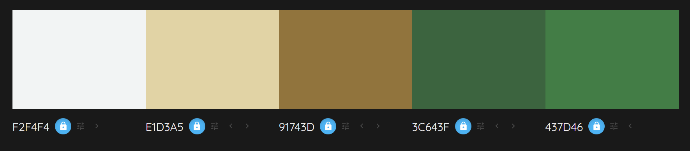

# EcologyWebsite

## Change of plan

The website will be built from zero using HTML, CSS and Javascript (some PHP is needed)

---

&nbsp;

This is my January 2022 project of building a website using WordPress. The website will be named **Environment as our First Priority**. It is supposed to follow the basic rules for the profesionnal development of a website:

&nbsp;
&nbsp;

1. **Structure**

> First draft of how pages could be organized

&nbsp;

* *For every page:*
  * Pop-up window (every page but only once per visit)
  * Maintenance page
  * RGPD legal page
  * Menu (logo, buttons/dropping list of buttons, change language)
  * Footer (logo, sitemap, social medias)

&nbsp;

* *Homepage*
  * description summarized of every part of the website

&nbsp;

* *Improvements*
  * *Footprint*
    * ways to improve our footprint (gas emissions, plastic, trash in general, food waste, water waste)
  * *"Lifehacks"/Solutions*
    * there is no better way than others to act (every action and every improvement is a step toward a better future)
    * ideas to find new solutions and improvements
  * *Inspirations*
    * websites, famous people/youtubers, names of experts

&nbsp;

* *Act Now*
  * *Spread the word*
    * talk about this topic with your close ones
    * and talk about solutions
    * finally, don't worry about anything, if they act then you did a great job
  * *Participate*
    * types of events you can join to help even more
  * *Gather people*
    * you can even create your own event if you have a bit of motivation to do so

&nbsp;

* *Blog*
  * search an article bar
  * connection to post comments on articles (admin for me, guest for others)
  * grid view for articles

&nbsp;

* *About*
  * Who I am and why this website

&nbsp;

* *Contact*
  * contact form

&nbsp;
&nbsp;

1. **Wireframes**

> Quickly draw the outlines of every pages
> 
> Here are some of them as well as links to final wireframes:

&nbsp;

* **Computer Version:**

&nbsp;

* **Phone Version:**

&nbsp;

* **Links:**
  * [Computer Homepage](https://wireframe.cc/3yO7qo)
  * [Phone Homepage](https://wireframe.cc/zUapIa)
  * [Computer Footprint](https://wireframe.cc/aXeLUQ)
  * [Computer Blog](https://wireframe.cc/lwjPLd)
  * [Computer Contact](https://wireframe.cc/WERq3G)

&nbsp;
&nbsp;

3. **Project Organization**

> Theme used: **OceanWP**
> 
> Page-builder used: **Elementor**
> 
> Plugin used:
> 
> * Central Color Palette
> * Polylang
> * Responsive Menu
> * Redirection
> * Duplicate Page
> * Short Pixel
> * WP Forms
> * Hustle
> * Insert Headers and Footers
> * SEO Press
> * Updraft Plus
> * Wordfence
> * WPS Hide Login
> * Livemesh Addons for Elementor
> 
> Graphic Charter:
> 
> * Logo: see below
> * Color Palette: see below
> * Fonts: Open Sans and Itim (some Caveat)

